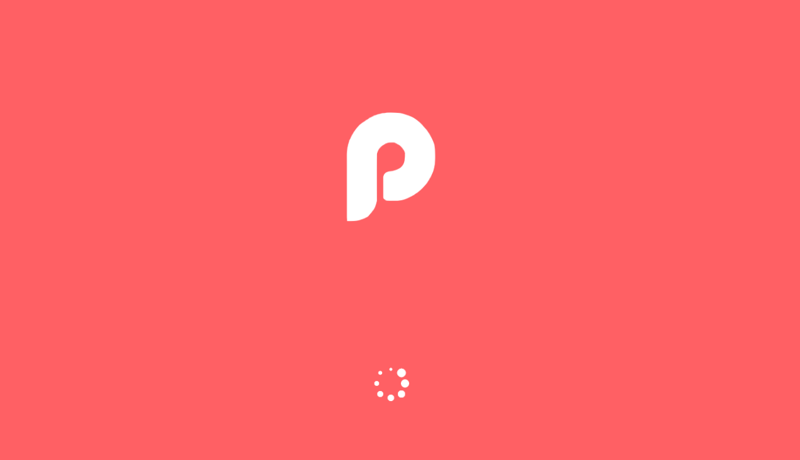

# Desafios UOL Compass

Este projeto consiste em um **onboarding interativo** para um aplicativo de gerenciamento de tarefas, focado em aumentar a produtividade dos usuários através do método Pomodoro. Ele foi desenvolvido utilizando as seguintes tecnologias:

- **HTML5** para a estruturação da página.
- **CSS3** para o design e a responsividade, garantindo que o layout se ajuste adequadamente a diferentes tamanhos de tela.
- **JavaScript** para a navegação entre os slides e a implementação de validações nos formulários do app.

O projeto é totalmente **responsivo**, adaptando-se a dispositivos móveis e desktops, proporcionando uma experiência fluida em qualquer resolução. Os formulários incluem validações para garantir a integridade dos dados inseridos pelo usuário.

Este projeto foi desenvolvido como parte de um **desafio da bolsa UOL Compass**, servindo como uma oportunidade para aplicar habilidades em desenvolvimento web e responsividade.


## Estrutura do Projeto

```bash
Desafio-01-AWS-React/
│
├── index.html              # Tela de carregamento
│
├── css/                    # Pasta para todos os arquivos CSS
│   ├── style.css           # Estilos globais
│   ├── loading.css         # Estilos específicos para a tela de carregamento
│   ├── onboarding.css      # Estilos específicos para o onboarding
│   ├── login.css           # Estilos específicos para a tela de login
│   ├── register.css        # Estilos específicos para a tela de registro
│   └── user-data.css       # Estilos específicos para a tela de dados do usuário
│   └── shared/             # Estilos compartilhados entre várias páginas
│
├── js/                     # Pasta para todos os arquivos JavaScript
│   ├── loading.js          # Lógica específica para a tela de carregamento
│   ├── onboarding.js       # Lógica específica para o onboarding
│   ├── login.js            # Lógica específica para a tela de login
│   ├── register.js         # Lógica específica para a tela de registro
│   ├── user-data.js        # Lógica específica para a tela de dados do usuário
│   └── utils/              # Funções utilitárias que podem ser reutilizadas em várias partes do projeto
│
├── pages/                  # Arquivos HTML para cada página da aplicação
│   ├── onboarding.html     # Tela de apresentação do projeto (Onboarding Screen)
│   ├── login.html          # Tela de login
│   ├── register.html       # Tela de registro
│   └── user-data.html      # Tela para ver os dados do usuário
│
└── assets/                 # Recursos estáticos como imagens, ícones, fontes, etc.
    ├── images/             # Imagens usadas na aplicação
    └── gif/                # Arquivos de gif
```
## Instrutores

Aqui estão os GitHub dos instrutores que estão me orientando durante o programa:

<table>
  <tr>
    <td></td>
    <td><a href="https://github.com/DevMateusmac" style="color: #1E90FF; font-weight: bold;">Mateus Mac</a></td>
    <td></td>
    <td><a href="https://github.com/JulianeMaran32" style="color: #FF6347; font-weight: bold;">Juliane Maran</a></td>
  </tr>
  <tr>
    <td></td>
    <td><a href="https://github.com/faagner7" style="color: #32CD32; font-weight: bold;">Fagner</a></td>
    <td></td>
    <td><a href="https://github.com/cassiotakarada-telefonica" style="color: #FFD700; font-weight: bold;">Cássio</a></td>
  </tr>
  <tr>
    <td></td>
    <td><a href="https://github.com/gabrielttrevisan" style="color: #6A5ACD; font-weight: bold;">Gabriel Trevisan</a></td>
    <td></td>
    <td><a href="https://github.com/cioatodavid" style="color: #FF1493; font-weight: bold;">David</a></td>
  </tr>
  <tr>
    <td></td>
    <td><a href="https://github.com/RafaelNCST" style="color: #20B2AA; font-weight: bold;">Rafael</a></td>
    <td></td>
    <td><a href="https://github.com/joaoelias1921" style="color: #DAA520; font-weight: bold;">João Elias</a></td>
  </tr>
  <tr>
    <td></td>
    <td><a href="https://github.com/cezarmezzalira" style="color: #8A2BE2; font-weight: bold;">Cezar Mezzalira</a></td>
    <td></td>
    <td><a href="https://github.com/Felipe-15" style="color: #FF4500; font-weight: bold;">Felipe Souza</a></td>
  </tr>
</table>
